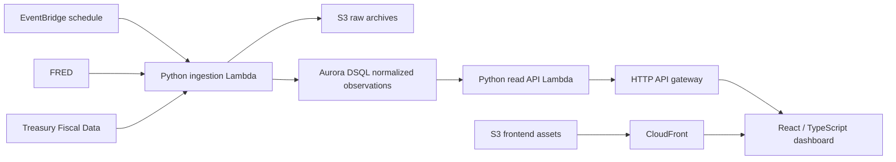

# Architecture

## Implemented locally

```text
FRED observations API
        |
Python CLI -> paginated HTTP client -> validation and normalization
        |                                  |
data/local/raw/fred/UNRATE/<run-id>.json     data/local/processed/UNRATE.json
                                           |
                          Python read API (127.0.0.1:8000)
                                           |
                             Vite /api development proxy
                                           |
                        React dashboard (127.0.0.1:5173)
```

Python 3.11+ is the initial runtime. Standard-library HTTP and JSON keep the ingestion scaffold runnable without dependency installation. `data/indicators.yaml` records catalog metadata; the current implementation intentionally supports only UNRATE and does not dynamically execute catalog entries.

The local read API uses a standard-library `ThreadingHTTPServer`, bound to loopback. `GET /api/series/UNRATE` validates and reads the processed snapshot on each request. Optional `start` and `end` parameters are inclusive ISO dates; unknown or duplicate parameters are rejected. Responses expose public metadata, coverage, filter scope, counts, and observations, excluding internal paths and ingestion identifiers. The API never calls FRED and requires no key. `GET /api/health` checks server availability only. JSON errors distinguish invalid requests, absent data, and corrupt snapshots; responses disable caching so reloads can see revisions. This is a development server, not a production HTTP runtime.

The React/TypeScript frontend uses Vite, Tailwind, and Recharts. Vite proxies `/api` to `127.0.0.1:8000` during development and local production preview; no CORS configuration or frontend credential is needed. The frontend fetches the whole stored series, validates it, and applies date filters locally to the chart, latest-in-range rate, counts, and accessible observation table. Presets are anchored to the latest saved month. Time-based horizontal positioning preserves date spacing; straight line segments avoid invented smoothed values, and missing observations break the line. Source dates use UTC month formatting; retrieval timestamps include the viewer's timezone. Reload retrieves the saved snapshot, never upstream data. A hosted API URL/proxy will be defined during deployment implementation.

The client requests ascending observations with original units and no frequency transformation. Network requests use a timeout and bounded retry/backoff for HTTP 429, HTTP 5xx, and connection failures. Authentication and other client errors fail immediately. Error output excludes request URLs and API credentials.

Each successful fetch produces a raw archive with all original response pages and a chart-ready latest snapshot. Normalization validates dates, numeric values, realtime fields, duplicate dates, date bounds, and the unemployment rate's 0–100 percent domain. FRED's `.` sentinel becomes JSON `null`. Writes use temporary files and atomic replacement; failed retrieval or validation does not replace the previous snapshot. Raw archival and snapshot publication are separate writes, not a cross-file transaction.

Snapshot contract (shape example only, not real economic data):

```json
{
  "schema_version": 1,
  "series_id": "UNRATE",
  "source": "FRED",
  "source_url": "https://fred.stlouisfed.org/series/UNRATE",
  "title": "Unemployment Rate",
  "units": "Percent",
  "frequency": "Monthly",
  "seasonal_adjustment": "Seasonally Adjusted",
  "retrieved_at": "2026-01-01T00:00:00+00:00",
  "requested_start": "2000-01-01",
  "requested_end": null,
  "observations": [
    {"date": "2000-01-01", "value": null, "realtime_start": "2026-01-01", "realtime_end": "2026-01-01"}
  ]
}
```

Observation dates identify periods, not publication dates. Realtime fields describe the returned FRED data version; preserving them does not implement a full vintage history. Re-runs replace the latest snapshot, accommodating revisions. Concurrent writers are outside the local scaffold's scope.

The Lambda entry point invokes the same ingestion service with local filesystem storage. It defaults to `/tmp/economic-dashboard`, which is ephemeral. It is a handler scaffold only; durable S3/DSQL adapters and deployment packaging remain to be implemented.

## Planned AWS design



API Gateway is a proposed HTTP boundary, additional to the initial stack. Confirm its configuration during the API milestone. Prefer one ingestion path per source and reusable normalization/storage interfaces. A proposed latest-observation key is `(source, series_id, observation_date)`; ingestion runs track retrieval time and raw archive references. Schema, DSQL SQL compatibility, authentication, and transaction behavior must be verified before selecting an upsert strategy.

Frontend: Vite, React, TypeScript, Tailwind, and Recharts are implemented locally. The local API contract provides series metadata, observations, date filters, and retrieval information; a production API adapter is still required. Python analytics will compute explicitly documented transformations rather than mixing series units or frequencies implicitly.

Terraform will define cloud infrastructure. GitHub Actions will run tests and validation, then later use AWS OIDC for authorized deployments. Store FRED credentials server-side in an appropriate AWS secret store; scope IAM access to necessary data and services. Add CloudWatch logging, failed-ingestion alerts, and freshness checks before scheduled operation. Source release dates and retrieval timestamps are separate freshness signals.

No Terraform resources, AWS connections, database migrations, or deployment workflows are created in this foundation.
